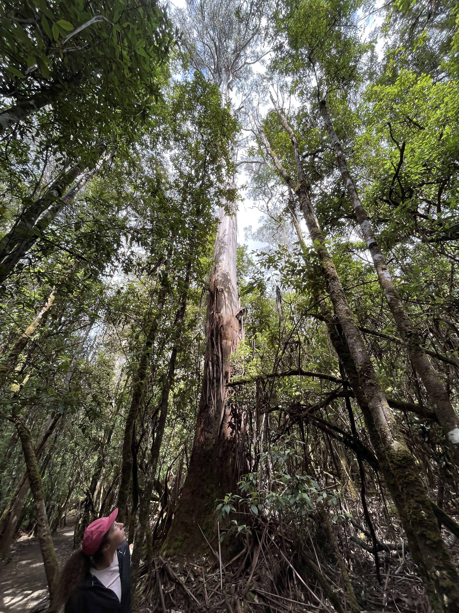

&nbsp;
&nbsp;
&nbsp;
&nbsp;
&nbsp;
&nbsp;

<figure>

<figcaption>Mount Field National Park, Tasmania</figcaption>
 

</figure>

[Research projects](projects.html)
 
[GitHub](https://github.com/lydialucchesi)
 
[Curriculum vitae](https://lydialucchesi.github.io/cv/cv_LydiaLucchesi.pdf)
 
[PhD thesis](https://lydialucchesi.github.io/thesis/thesis_LydiaLucchesi.pdf)
 
[Contact](mailto:lydia.lucchesi@anu.edu.au)

  

Hello, my name is Lydia! I am a researcher interested in data provenance, data preprocessing, data visualization, uncertainty communication, and R software development.

I recently completed my PhD in computer science (conferral in July 2024) at the Australian National University (ANU) under the supervision of Professor Lexing Xie, Dr. Petra Kuhnert, and Professor Jenny L. Davis. My doctoral research resulted in a new visualization ([Smallset Timelines](https://dl.acm.org/doi/10.1145/3531146.3533175)) and R software package ([smallsets](https://CRAN.R-project.org/package=smallsets)) for documenting data preprocessing decisions. 

During my doctoral program, I was a Data61 affiliate at CSIRO (Australia's national science agency) and a team member of the Humanising Machine Intelligence project and Computational Media Lab at ANU.

Previously, I completed a two-year post-bachelor fellowship at the Institute for Health Metrics and Evaluation (IHME) in Seattle, where I modeled the health burden of non-fatal injuries on the Global Burden of Disease (GBD) study. I have a Bachelor of Arts in statistics from the University of Missouri and completed my honors thesis on uncertainty visualization in spatial statistics under the supervision of Professor Christopher K. Wikle.
