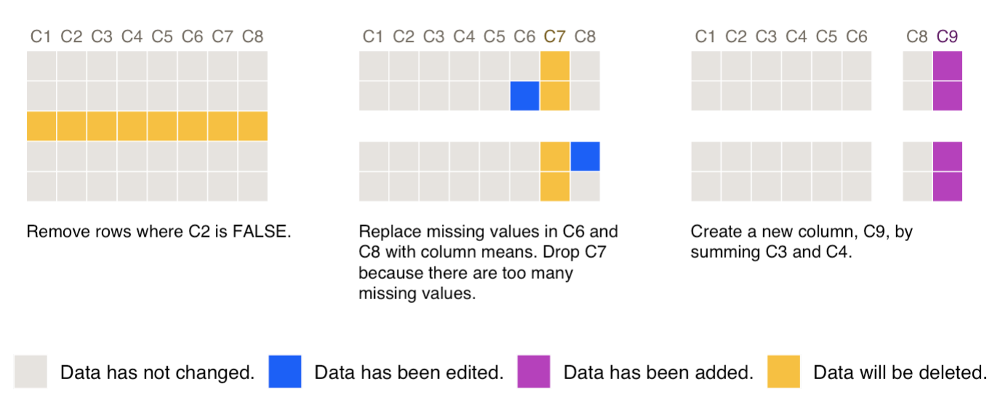
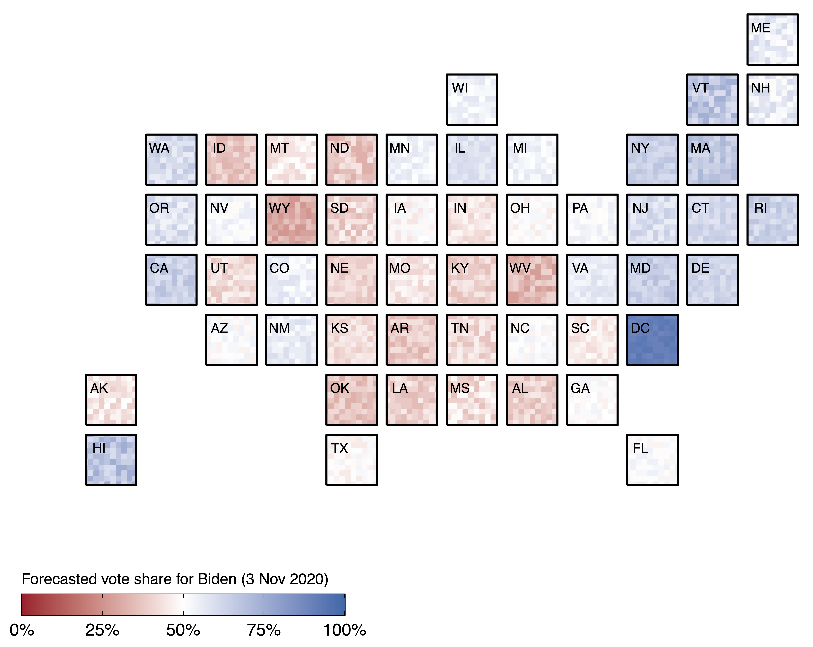

I'm a PhD candidate in the School of Computing at the Australian National University (ANU), Canberra. My thesis topic is data preprocessing. **I'm interested in developing visualisation tools for documenting and communicating data preprocessing decisions.** This research is conducted under the supervision of Professor Lexing Xie (ANU School of Computing), Dr. Petra Kuhnert (StatML at CSIRO Data61), and Dr. Jenny L. Davis (ANU School of Sociology).

I'm a Data61 affiliate at CSIRO (Australia's national science organisation), a team member of the ANU's Humanising Machine Intelligence research initiative, and part of the Computational Media Lab at ANU. Prior to ANU, I completed a two-year post-bachelor fellowship at the Institute for Health Metrics and Evaluation (IHME) at the University of Washington, Seattle, where I modelled the health burden of non-fatal injuries on the Global Burden of Disease study. I have a Bachelor of Arts in Statistics from the University of Missouri, Columbia, and completed my undergraduate honours thesis on uncertainty visualisation in spatial statistics under the supervision of Professor Christopher K. Wikle.

My research interests include data preprocessing, data provenance, and data visualisation. I enjoy building visualisation systems in R and being a part of interdisciplinary research teams.

## Current projects

The uniting theme between these projects is visualising information, from/about a data analysis, that is often overlooked in research dissemination, despite its relevance to our understanding and interpretation of the analysis.

### smallsets: Visual documentation for data preprocessing

The [smallsets R package](https://lydialucchesi.github.io/smallsets/) generates visual documentation for data preprocessing in R, R Markdown, and Python. Users add structured comments to their preprocessing code and pass it to smallsets. The output from smallsets is a [Smallset Timeline](https://dl.acm.org/doi/abs/10.1145/3531146.3533175), a static and compact visualisation providing a step-by-step explanation of preprocessing decisions. It uses a small set ("Smallset") of rows from the original dataset to visualise the process at a manageable scale.

**smallsets website: [lydialucchesi.github.io/smallsets/](https://lydialucchesi.github.io/smallsets/)**

**Smallset Timeline paper in FAccT '22 proceedings: [doi.org/10.1145/3531146.3533175](https://dl.acm.org/doi/abs/10.1145/3531146.3533175)**

Below is a Smallset Timeline visualising the preprocessing of a synthetic dataset with 100 rows and eight columns (C1-C8). It uses a Smallset of five rows.

### Vizumap: Visualising uncertainty on maps

The [Vizumap R package](https://lydialucchesi.github.io/Vizumap/) offers four methods for mapping statistical estimates and uncertainties simultaneously. Users can build a bivariate map, pixel map (with optional animated flickering), glyph map, or exceedance probability map. Vizumap has been used in [ecology](https://www.nature.com/articles/s41598-020-73897-1) and [public health](https://bmcpublichealth.biomedcentral.com/articles/10.1186/s12889-022-13170-4) research. There is also a [VizumApp Shiny app](https://shiny.csiro.au/VizumApp/) based on the Vizumap package.

Below is an example pixel map that I built with Vizumap. Pixel maps divide regions into pixels, and the pixels are filled with values sampled from the confidence interval for a region's estimate. The U.S. equal area cartogram below visualises [2020 election forecasts from FiveThirtyEight](https://github.com/fivethirtyeight/data/tree/15f210532b2a642e85738ddefa7a2945d47e2585/election-forecasts-2020). The pixel values are uniformly sampled from the 80\% confidence interval for each state's forecasted vote share for Biden.

